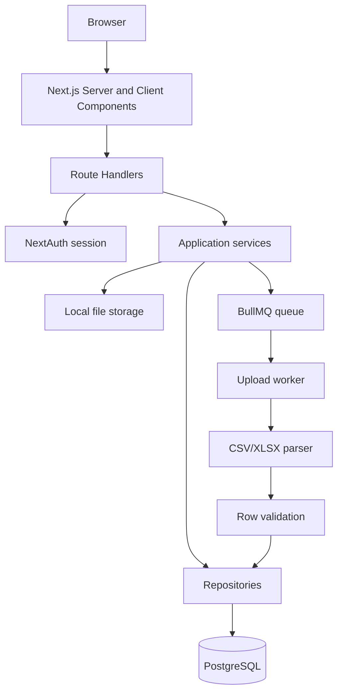
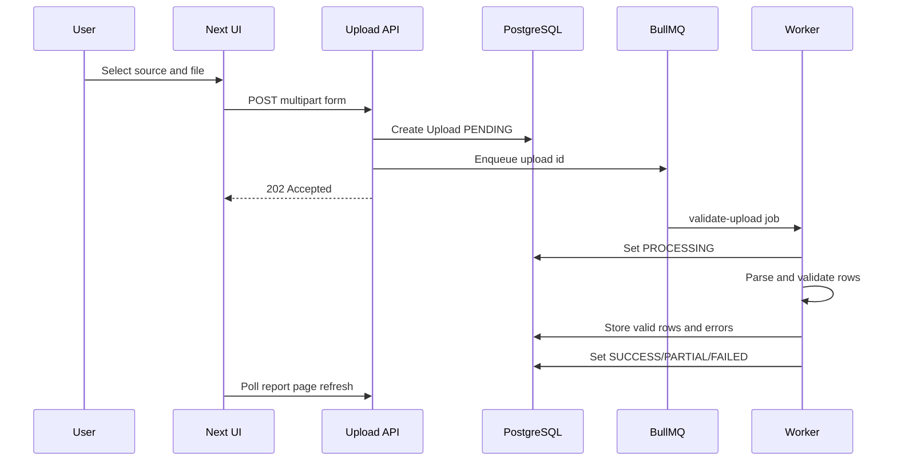
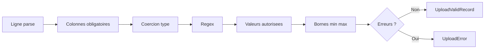

# DESIGN - DataFlow CI

## 1. Comprehension du probleme

DataFlow CI recoit chaque jour des fichiers CSV et Excel de clients differents. Le probleme principal n'est pas seulement de parser un fichier : il faut savoir quelle source l'a produit, quelle version de schema etait active au moment de l'upload, quelles lignes sont valides, quelles lignes doivent etre renvoyees au client, et comment suivre le traitement dans le temps.

Les hypotheses prises pour le MVP :

- Un utilisateur possede ses sources et ne voit pas celles des autres.
- Une source est derivee d'un schema JSON Artefact contenant metadata, configuration fichier, colonnes et contraintes de ligne.
- Une source a toujours une version de schema active.
- Modifier un schema cree une nouvelle version. Les anciennes versions ne sont jamais ecrasees.
- Un upload est rattache a la version active au moment de l'envoi et utilise le separateur/date format stocke pour cette source.
- Les fichiers sont stockes localement pour le MVP, mais l'interface `storage` peut etre remplacee par S3/GCS.
- Le traitement est asynchrone via BullMQ + Redis, avec un worker separe du serveur web.

## 2. Architecture

Le code est organise par responsabilites :

- `src/app` : pages Next.js et route handlers.
- `src/features` : composants React orientes usage.
- `src/components/ui` : primitives UI Shadcn-style.
- `src/services` : cas d'usage applicatifs.
- `src/repositories` : acces Prisma.
- `src/lib/validation` : validation metier pure et parsing.
- `src/lib/queue` et `src/jobs` : BullMQ et worker.
- `prisma` : schema relationnel et seed.

Pourquoi cette architecture :

- Les composants React ne contiennent pas de logique de validation metier.
- Les route handlers restent minces : authentification, parsing request, appel service.
- Les services orchestrent les cas d'usage : creer une source, creer un upload, traiter un upload.
- Les repositories isolent Prisma, ce qui facilite les tests et les changements de modele.
- La validation est pure, donc testable sans base ni framework.

## 3. Modelisation metier

Entites principales :

- `User` : proprietaire des sources.
- `Source` : fournisseur ou flux de donnees.
- `SchemaVersion` : version immutable du schema d'une source.
- `SchemaColumn` : colonne attendue avec type et contraintes.
- `Upload` : fichier charge et etat de traitement.
- `UploadError` : erreur detaillee par ligne et colonne.
- `UploadValidRecord` : ligne valide normalisee.
- `AuditLog` : trace des actions importantes.

Le modele conserve aussi `externalId`, `ownerLabel`, `expectedFrequency`, `fileFormat`, `delimiter`, `encoding`, `hasHeader` et `rowConstraints` sur `Source`. Ces champs viennent du JSON officiel et evitent de coder des hypotheses dans le formulaire.

Invariants importants :

- `Source(ownerId, name)` est unique pour eviter les doublons dans un espace utilisateur.
- `SchemaVersion(sourceId, version)` est unique.
- Une modification de schema desactive les anciennes versions et cree une nouvelle version.
- Un upload reference une version precise, pas seulement la source.
- Les erreurs et lignes valides sont supprimees puis remplacees si un job est rejoue.

## 4. Flux d'upload

L'utilisateur recupere la main immediatement apres l'upload. La page de rapport se rafraichit tant que le statut est `PENDING` ou `PROCESSING`.

## 5. Validation

La validation se fait ligne par ligne :

Types supportes :

- `string` : trim de la valeur.
- `number` : conversion numerique, virgule acceptee.
- `integer` : conversion numerique puis controle entier.
- `date` : ISO et format `JJ/MM/AAAA`.
- `boolean` : `true/false`, `1/0`, `oui/non`, `vrai/faux`.
- `enum` : valeur texte controlee par `allowed_values`.

Les formats de date sont strictement pris depuis le JSON : `YYYY-MM-DD` pour Orange CI et `DD/MM/YYYY` pour Banque Atlantique. Les separateurs CSV sont aussi pris depuis la source : `,` et `;`.

Une ligne est consideree valide uniquement si toutes les colonnes du schema passent. Toutes les erreurs sont conservees afin que le client recoive un feedback complet.

## 6. Choix techniques

- Next.js App Router : un seul projet TypeScript pour UI et backend, simple a deployer.
- PostgreSQL : relations fortes, historiques, JSON pour lignes valides normalisees.
- Prisma : schema lisible, migrations, type safety.
- BullMQ + Redis : queue robuste, retry, backoff, worker separe.
- NextAuth Credentials : auth basique conforme au MVP, mot de passe hash bcrypt.
- Zod : validation des payloads et erreurs exploitables.
- Recharts : charts React simples pour le dashboard.
- Tailwind + Shadcn-style : UI rapide, coherente et responsive.

## 7. Trade-offs

- Stockage local au lieu de S3 : plus simple pour un challenge local, mais a remplacer avant production multi-instance.
- Pas de streaming de fichiers : suffisant pour 10 MB, mais a revoir pour des fichiers plus gros.
- Pas de websocket : le polling/refresh est plus simple et robuste pour le MVP.
- Auth sans roles : le besoin demande une auth basique, pas d'RBAC.
- Tests centres sur le domaine : les tests E2E navigateur restent a ajouter.

## 8. Limites du MVP

- Pas de detection avancee des doublons metier entre lignes.
- Pas de mapping interactif de colonnes si le client change les noms.
- Pas de notification email au client apres traitement.
- Pas de stockage cloud ni antivirus fichier.
- Pas de dashboard multi-tenant admin.

## 9. Next steps

Avec deux semaines de plus :

- Ajouter un stockage S3 compatible Railway/Vercel.
- Ajouter Playwright pour couvrir login, creation source, upload, rapport.
- Ajouter un ecran de reconciliation pour corriger des lignes invalides.
- Ajouter un systeme de notifications et webhooks.
- Ajouter un audit viewer et une gestion de roles.
- Ajouter le versionning de regles avancees : unicite, dependances entre colonnes, contraintes cross-row.
