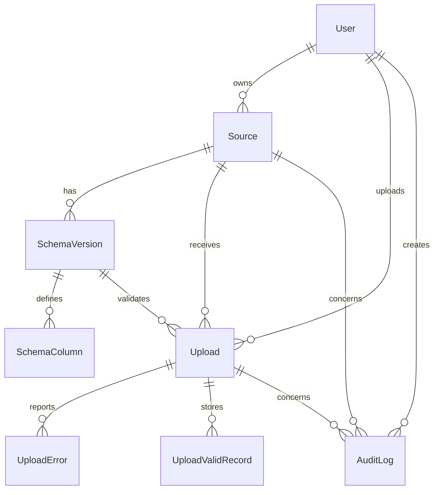

# DESIGN - DataFlow CI

## 1. Compréhension du besoin

### Problème

DataFlow CI est une plateforme d'ingestion de fichiers CSV/Excel provenant de clients différents (Orange CI, Banque Atlantique, etc.). Le problème central n'est pas simplement de parser des fichiers : il faut savoir :

- Quelle source a produit le fichier ?
- Quelle version du schéma était active au moment de l'upload ?
- Quelles lignes sont valides selon ce schéma ?
- Quelles lignes doivent être renvoyées au client avec des erreurs détaillées ?
- Comment suivre le traitement dans le temps (audit, historique) ?

Les clients envoient des fichiers avec des formats différents (séparateurs, formats de date, colonnes) et s'attendent à un feedback rapide et précis sur la qualité de leurs données.

### Hypothèses prises

1. **Multi-tenant par utilisateur** : Un utilisateur possède ses sources et ne voit pas celles des autres. Pas de rôle admin ou de gestion multi-tenant dans ce MVP.

2. **Schémas versionnés** : Une source peut évoluer dans le temps. Modifier un schéma crée une nouvelle version. Les anciennes versions ne sont jamais écrasées. Un upload est toujours lié à une version précise, pas seulement à la source.

3. **Traitement asynchrone** : Les fichiers peuvent être volumineux (jusqu'à 10 MB). Le traitement ne doit pas bloquer l'interface utilisateur. On utilise une queue (BullMQ + Redis) avec un worker séparé.

4. **Validation stricte** : Une ligne est valide uniquement si toutes les colonnes du schéma passent. Toutes les erreurs sont conservées pour donner un feedback complet au client.

5. **Stockage local** : Pour ce MVP, les fichiers sont stockés localement. En production, on utiliserait S3/GCS pour la scalabilité et la redondance.

6. **Pas de streaming** : Les fichiers sont lus en mémoire entière. Suffisant pour 10 MB, mais à revoir pour des fichiers plus gros.

7. **Auth basique** : NextAuth Credentials avec mot de passe hash bcrypt. Pas de rôles, pas de RBAC, pas de MFA.

## 2. Architecture

### Structure du projet

```
src/
├── app/              # Next.js App Router (pages + API routes)
│   ├── (auth)/       # Pages d'authentification
│   ├── api/          # API REST
│   ├── uploads/      # Pages et routes d'upload
│   └── sources/      # Pages et routes de gestion des sources
├── components/       # Composants UI réutilisables
│   └── ui/           # Primitives Shadcn-style
├── services/         # Logique métier (cas d'usage)
├── repositories/     # Accès aux données (Prisma)
├── lib/              # Utilitaires et configuration
│   ├── validation/   # Validation métier pure
│   └── queue/        # Configuration BullMQ
├── jobs/             # BullMQ worker
└── types/            # Types TypeScript
```

### Flux de données

```mermaid
flowchart TD
    User[Utilisateur] -->|1. Upload fichier| API[API Upload POST /api/uploads]
    API -->|2. Créer Upload PENDING| DB[(PostgreSQL)]
    API -->|3. Enqueue job| Queue[BullMQ Queue]
    API -->|4. Réponse 202 Accepted| User
    Queue -->|5. Traitement asynchrone| Worker[Worker]
    Worker -->|6. Parser fichier| Parser[CSV/XLSX Parser]
    Parser -->|7. Valider ligne par ligne| Validator[Validator]
    Validator -->|8. Stocker résultats| DB
    Worker -->|9. Mise à jour statut| DB
    User -->|10. Polling page détail| UI[Page /uploads/[id]]
    UI -->|11. Récupérer upload| DB
    DB -->|12. Afficher statut + erreurs| UI
```

### Choix d'architecture

**Pourquoi Next.js App Router ?**
- Un seul projet TypeScript pour UI et backend
- Server Components pour les données (pas de client-side fetching inutile)
- Route Handlers pour l'API REST
- Déploiement simplifié (un seul build)
- Type safety entre frontend et backend

**Pourquoi séparation Services/Repositories ?**
- **Services** : Orchestrent les cas d'usage (créer source, traiter upload). Ils contiennent la logique métier.
- **Repositories** : Isolent l'accès à Prisma. Facilite les tests et les changements d'ORM.
- **Validation pure** : La logique de validation est dans `src/lib/validation`, sans dépendance à Prisma ou Next.js. Testable unitairement.

**Pourquoi BullMQ + Redis ?**
- Queue robuste avec retry, backoff, dead letter queue
- Worker séparé du serveur web (scalabilité indépendante)
- Redis est rapide et fiable pour la queue
- Compatible Railway (service Redis natif)

## 3. Modélisation du domaine

### Entités principales



### Invariants importants

1. **Unicité source** : `Source(ownerId, name)` est unique. Un utilisateur ne peut pas avoir deux sources avec le même nom.

2. **Unicité version** : `SchemaVersion(sourceId, version)` est unique. On ne peut pas avoir deux versions avec le même numéro pour une source.

3. **Version active** : Une seule version de schéma est active par source à un moment donné. Quand on crée une nouvelle version, l'ancienne est désactivée.

4. **Upload immuable** : Un upload est lié à une version précise de schéma. Même si le schéma évolue, l'upload reste lié à sa version originale.

5. **Remplacement des résultats** : Si un job est rejoué (par exemple après correction du schéma), les erreurs et lignes valides sont supprimées puis remplacées. On ne garde pas l'historique des traitements.

6. **Audit trail** : Toute action importante (création source, modification schéma, upload) est tracée dans `AuditLog`.

### Relations clés

- **User → Source → SchemaVersion → SchemaColumn** : Un utilisateur possède des sources, chaque source a des versions de schéma, chaque version a des colonnes.
- **Source → Upload → UploadError/UploadValidRecord** : Une source reçoit des uploads, chaque upload a des erreurs et des lignes valides.
- **SchemaVersion → Upload** : Un upload est validé contre une version précise de schéma, pas seulement contre la source.

## 4. Choix techniques

### Framework backend : Next.js API Routes

**Pourquoi ?**
- Intégration native avec le frontend (même projet, même types)
- Server Components permettent de faire des requêtes Prisma directement depuis les composants
- Route Handlers pour l'API REST
- Déploiement simplifié (un seul build Next.js)

**Alternatives considérées :**
- Express/Fastify : Auraient nécessité un projet séparé pour le backend, plus de complexité pour le déploiement.
- NestJS : Surdimensionné pour ce MVP, courbe d'apprentissage plus élevée.

### Base de données : PostgreSQL

**Pourquoi ?**
- Relations fortes entre entités (User, Source, SchemaVersion, Upload, etc.)
- JSONB pour stocker les données des lignes valides normalisées
- Transactions ACID pour garantir la cohérence (création upload + enqueue job)
- Compatible Railway (service PostgreSQL natif)
- Prisma ORM excellent pour TypeScript

**Alternatives considérées :**
- SQLite : Pas adapté pour Railway (pas de persistance entre redéploiements).
- MongoDB : Moins adapté pour les relations fortes et les transactions.
- MySQL : Bon choix aussi, mais PostgreSQL a des fonctionnalités JSON plus avancées.

### ORM : Prisma

**Pourquoi ?**
- Schema lisible et type-safe en TypeScript
- Migrations automatiques
- Client Prisma généré automatiquement avec les types
- Excellent support PostgreSQL
- Facile à tester (mocking possible)

**Alternatives considérées :**
- Drizzle : Plus léger, mais moins mature que Prisma.
- Kysely : Type-safe mais plus verbeux, moins de "magie".
- Raw SQL : Trop verbeux, pas de type safety.

### Gestion de l'async : BullMQ + Redis

**Pourquoi ?**
- Queue robuste avec retry, backoff, dead letter queue
- Worker séparé du serveur web (scalabilité indépendante)
- Compatible Railway (service Redis natif)
- API simple et bien documentée
- Support pour les jobs prioritaires, retardés, etc.

**Alternatives considérées :**
- `setImmediate` : Pas de retry, pas de persistance, pas adapté pour la production.
- Inngest : Service externe, plus complexe à configurer.
- Trigger.dev : Similaire à Inngest, service externe.

### Stockage de fichiers : Filesystem local

**Pourquoi ?**
- Simple pour un MVP local
- Pas de dépendance externe
- Suffisant pour 10 MB

**Limites et alternatives :**
- **Problème** : Pas persistant entre redéploiements Railway (résolu avec volume persistant).
- **Alternative production** : S3/GCS pour la scalabilité, la redondance et la performance.

### Auth : NextAuth.js Credentials

**Pourquoi ?**
- Intégration native avec Next.js
- Support Credentials provider (email + mot de passe)
- Sessions JWT stockées en base (via Prisma adapter)
- Middleware pour protéger les routes
- Facile à configurer

**Alternatives considérées :**
- Clerk : Service externe, plus complexe pour un MVP.
- better-auth : Plus récent, moins de documentation.
- Custom : Trop de travail pour un MVP (hash, sessions, CSRF, etc.).

### Hébergement : Railway

**Pourquoi ?**
- Support natif PostgreSQL, Redis, volumes persistants
- Configuration simple via UI ou fichier `railway.json`
- Déploiement automatique depuis GitHub
- Services séparés (web, worker, postgres, redis)
- Bon rapport qualité/prix pour un MVP

**Alternatives considérées :**
- Vercel : Excellent pour Next.js, mais pas de support natif Redis/worker (nécessiterait des services externes).
- Render : Similaire à Railway, mais moins mature pour les workers.
- AWS/GCP : Surdimensionné pour un MVP, complexité élevée.

## 5. Ce qui marche, ce qui ne marche pas, ce qui manque

### Ce qui marche

- ✅ Upload de fichiers CSV/XLSX jusqu'à 10 MB
- ✅ Traitement asynchrone via BullMQ + Redis
- ✅ Validation ligne par ligne avec conservation des erreurs détaillées
- ✅ Export CSV des lignes valides
- ✅ Dashboard avec visualisations Recharts
- ✅ Gestion des sources avec import de schémas JSON
- ✅ Versionning immuable des schémas
- ✅ Authentification avec NextAuth
- ✅ Déploiement fonctionnel sur Railway avec volume persistant
- ✅ Support de différents séparateurs CSV (`,` et `;`)
- ✅ Support de différents formats de date (`YYYY-MM-DD` et `DD/MM/YYYY`)

### Ce qui ne marche pas

- ❌ **Notifications email** : Le service SMTP n'est pas configuré sur Railway (timeout de connexion). Les variables SMTP doivent être ajoutées manuellement sur les services web et worker.

- ❌ **Tests E2E** : Les tests couvrent uniquement la logique de validation et le parsing. Pas de tests navigateur avec Playwright.

### Ce qui manque

- 🔲 **Stockage cloud** : Les fichiers sont stockés localement. En production, S3/GCS serait préférable pour la scalabilité.

- 🔲 **Streaming de fichiers** : Les fichiers sont lus en mémoire entière. Pour des fichiers > 10 MB, il faudrait un streaming.

- 🔲 **Websocket/SSE** : Le polling actuel pour rafraîchir le statut d'upload pourrait être remplacé par Server-Sent Events ou Websocket.

- 🔲 **Mapping interactif de colonnes** : Si un client change les noms de colonnes, il n'y a pas d'interface pour mapper les colonnes.

- 🔲 **Détection de doublons métier** : Pas de validation cross-lignes (unicité, dépendances entre colonnes).

- 🔲 **Rôles et permissions** : Pas de RBAC. Tous les utilisateurs ont les mêmes droits.

- 🔲 **Audit viewer** : Les logs d'audit existent en base mais pas d'interface pour les visualiser.

## 6. Trade-offs assumés

### Stockage local vs S3/GCS

**Trade-off** : J'ai choisi le stockage local pour la simplicité du MVP.

**Justification** :
- Avantages : Pas de dépendance externe, configuration simple, suffisant pour 10 MB.
- Inconvénients : Pas persistant entre redéploiements (résolu avec volume Railway), pas scalable.

**Si j'avais 2 semaines de plus** : J'implémenterais S3/GCS avec un service d'abstraction pour faciliter le switch.

### Pas de streaming vs streaming

**Trade-off** : J'ai choisi de lire les fichiers en mémoire entière.

**Justification** :
- Avantages : Code plus simple, suffisant pour 10 MB.
- Inconvénients : Problèmes de mémoire pour des fichiers plus gros.

**Si j'avais 2 semaines de plus** : J'implémenterais un streaming avec PapaParse stream mode.

### Polling vs Websocket/SSE

**Trade-off** : J'ai choisi le polling pour rafraîchir le statut d'upload.

**Justification** :
- Avantages : Plus simple à implémenter, plus robuste (pas de connexion persistante).
- Inconvénients : Moins réactif, plus de requêtes serveur.

**Si j'avais 2 semaines de plus** : J'implémenterais Server-Sent Events pour un temps réel plus propre.

### Auth basique vs RBAC

**Trade-off** : J'ai choisi une auth basique sans rôles.

**Justification** :
- Avantages : Plus simple, suffisant pour le MVP (chaque utilisateur voit ses propres données).
- Inconvénients : Pas de gestion des permissions, pas d'admin.

**Si j'avais 2 semaines de plus** : J'ajouterais un système de rôles (admin, user, viewer) avec RBAC.

### Validation ligne par ligne vs validation cross-lignes

**Trade-off** : J'ai choisi une validation ligne par ligne uniquement.

**Justification** :
- Avantages : Plus simple à implémenter et à tester, parallélisable.
- Inconvénients : Pas de validation de contraintes cross-lignes (unicité, sommes, etc.).

**Si j'avais 2 semaines de plus** : J'ajouterais un système de règles avancées avec validation cross-lignes.

## 7. Next steps

Si j'avais 2 semaines de plus, voici ce que je ferais (par ordre de priorité) :

### 1. Stockage cloud (S3/GCS)

- Créer un service d'abstraction `storage` avec des implémentations Local et S3
- Configurer S3 sur Railway ou utiliser un bucket externe
- Migrer les fichiers existants vers S3
- Avantages : Scalabilité, redondance, performance

### 2. Tests E2E avec Playwright

- Installer et configurer Playwright
- Écrire des tests pour : login, création source, upload, rapport d'ingestion, export
- Intégrer les tests dans le CI/CD
- Avantages : Confiance dans le déploiement, détection de régressions

### 3. Notifications email fonctionnelles

- Configurer les variables SMTP sur Railway
- Tester avec différents providers (Gmail, SendGrid)
- Ajouter des templates d'email plus riches
- Avantages : Meilleure UX, feedback automatique

### 4. Server-Sent Events pour le temps réel

- Remplacer le polling par SSE pour le statut d'upload
- Implémenter un endpoint `/api/uploads/[id]/events`
- Mettre à jour l'UI en temps réel
- Avantages : Meilleure UX, moins de requêtes serveur

### 5. Streaming de fichiers

- Implémenter le streaming avec PapaParse stream mode
- Traiter les fichiers par chunks pour réduire la mémoire
- Avantages : Support de fichiers plus volumineux, meilleure performance

### 6. Audit viewer

- Créer une page `/audit` pour visualiser les logs d'audit
- Filtrer par utilisateur, source, action, date
- Export des logs en CSV
- Avantages : Transparence, debugging facilité

### 7. Système de rôles et permissions

- Ajouter un champ `role` sur User (admin, user, viewer)
- Implémenter un middleware de vérification de permissions
- Créer une page admin pour gérer les utilisateurs
- Avantages : Meilleure sécurité, gestion multi-tenant

### 8. Validation cross-lignes

- Ajouter un système de règles avancées (unicité, sommes, dépendances)
- Implémenter une phase de validation après la validation ligne par ligne
- Avantages : Validation métier plus complète

### 9. Mapping interactif de colonnes

- Créer une interface pour mapper les colonnes si le client change les noms
- Sauvegarder le mapping par source
- Avantages : Flexibilité, moins d'erreurs

### 10. Webhooks

- Ajouter un système de webhooks pour notifier des services externes
- Configurer des webhooks par source (par exemple pour envoyer les données valides vers un CRM)
- Avantages : Intégration avec d'autres systèmes, automatisation
