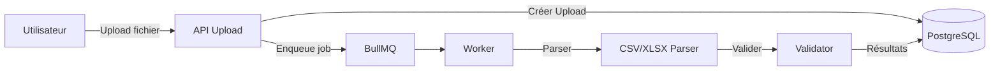
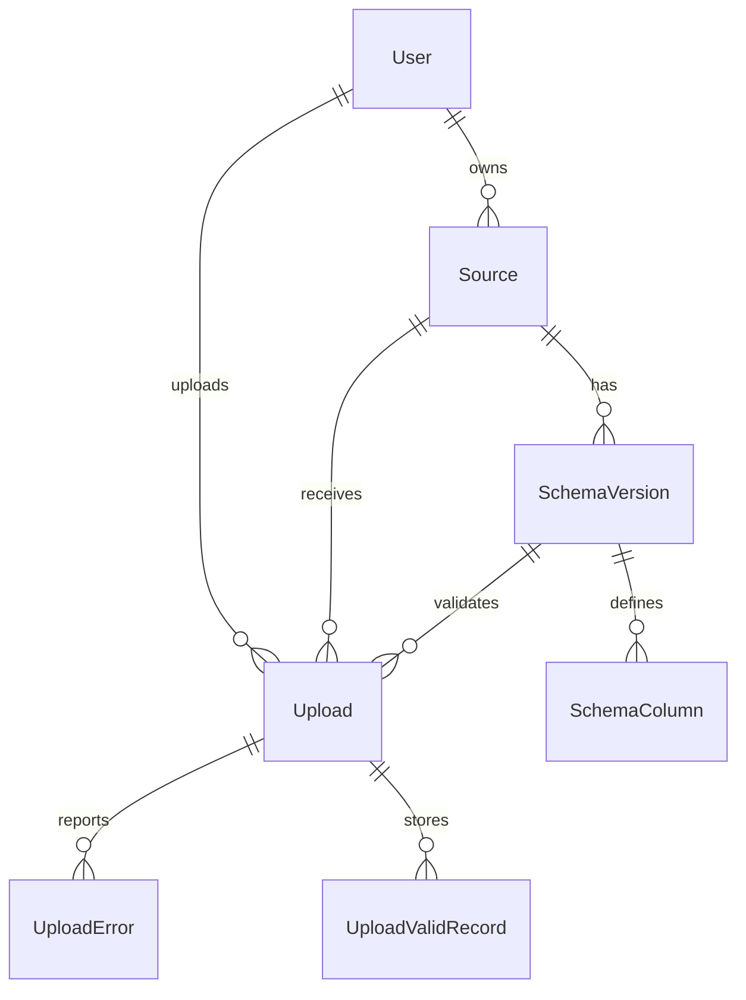

# DESIGN - DataFlow CI

## Overview

DataFlow CI est une plateforme d'ingestion de fichiers CSV/Excel avec validation de données basée sur des schémas versionnés.

## Architecture

### Structure du projet

```
src/
├── app/              # Next.js App Router (pages + API routes)
├── components/       # Composants UI réutilisables
├── services/         # Logique métier
├── repositories/     # Accès aux données (Prisma)
├── lib/              # Utilitaires et configuration
├── jobs/             # BullMQ worker
└── types/            # Types TypeScript
```

### Flux de données



## Modèle de données

### Entités principales

- **User** : Utilisateurs de l'application
- **Source** : Source de données (client, flux)
- **SchemaVersion** : Version du schéma d'une source
- **SchemaColumn** : Colonne avec type et contraintes
- **Upload** : Fichier uploadé et statut de traitement
- **UploadError** : Erreurs détaillées par ligne
- **UploadValidRecord** : Lignes valides normalisées

### Relations



## Validation des données

### Types supportés

- `string` : Texte
- `number` : Nombre décimal
- `integer` : Entier
- `date` : Date (YYYY-MM-DD ou DD/MM/YYYY)
- `boolean` : Booléen
- `enum` : Valeur parmi une liste

### Contraintes

- `required` : Champ obligatoire
- `regex` : Expression régulière
- `allowed_values` : Liste de valeurs autorisées
- `min` / `max` : Bornes numériques

## Traitement asynchrone

Le traitement des fichiers est asynchrone via BullMQ + Redis :

1. Upload du fichier → Création d'un enregistrement `PENDING`
2. Envoi dans la queue BullMQ
3. Worker traite le fichier en arrière-plan
4. Mise à jour du statut : `PROCESSING` → `SUCCESS` / `PARTIAL` / `FAILED`

## Stack technique

- **Framework** : Next.js 15 (App Router)
- **Langage** : TypeScript
- **Base de données** : PostgreSQL
- **ORM** : Prisma
- **Queue** : BullMQ + Redis
- **Auth** : NextAuth.js
- **UI** : TailwindCSS + Shadcn UI
- **Charts** : Recharts
- **Validation** : Zod

## Déploiement

L'application est déployée sur Railway avec :

- Service web : Next.js standalone
- Service worker : BullMQ worker
- PostgreSQL : Base de données
- Redis : Queue BullMQ
- Volume persistant : Stockage des fichiers uploadés
