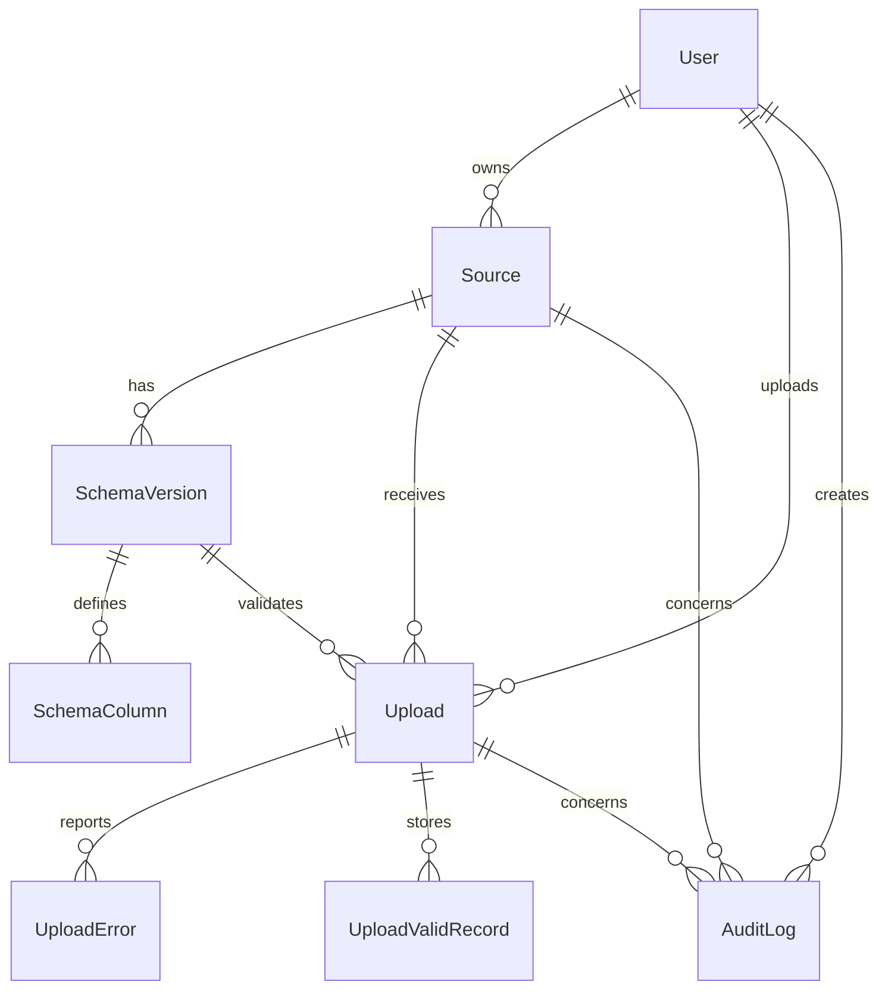

# DESIGN - DataFlow CI

## 1. Compréhension du besoin

### Problème

DataFlow CI est une plateforme d'ingestion de fichiers CSV/Excel provenant de clients différents (Orange CI, Banque Atlantique, etc.). Le problème central n'est pas simplement de parser des fichiers : il faut savoir :

- Quelle source a produit le fichier ?
- Quelle version du schéma était active au moment de l'upload ?
- Quelles lignes sont valides selon ce schéma ?
- Quelles lignes doivent être renvoyées au client avec des erreurs détaillées ?
- Comment suivre le traitement dans le temps (audit, historique) ?

Les clients envoient des fichiers avec des formats différents (séparateurs, formats de date, colonnes) et s'attendent à un feedback rapide et précis sur la qualité de leurs données.

### Hypothèses prises

1. **Multi-tenant par utilisateur** : Un utilisateur possède ses sources et ne voit pas celles des autres. Pas de rôle admin ou de gestion multi-tenant dans ce MVP.

2. **Schémas versionnés** : Une source peut évoluer dans le temps. Modifier un schéma crée une nouvelle version. Les anciennes versions ne sont jamais écrasées. Un upload est toujours lié à une version précise, pas seulement à la source.

3. **Traitement asynchrone** : Les fichiers peuvent être volumineux (jusqu'à 10 MB). Le traitement ne doit pas bloquer l'interface utilisateur. On utilise une queue (BullMQ + Redis) avec un worker séparé.

4. **Validation stricte** : Une ligne est valide uniquement si toutes les colonnes du schéma passent. Toutes les erreurs sont conservées pour donner un feedback complet au client.

5. **Stockage local** : Pour ce MVP, les fichiers sont stockés localement. En production, on utiliserait S3/GCS pour la scalabilité et la redondance.

6. **Pas de streaming** : Les fichiers sont lus en mémoire entière. Suffisant pour 10 MB, mais à revoir pour des fichiers plus gros.

7. **Auth basique** : NextAuth Credentials avec mot de passe hash bcrypt. Pas de rôles, pas de RBAC, pas de MFA.

## 2. Architecture

### Structure du projet

```
src/
├── app/              # Next.js App Router (pages + API routes)
│   ├── (auth)/       # Pages d'authentification
│   ├── api/          # API REST
│   ├── uploads/      # Pages et routes d'upload
│   └── sources/      # Pages et routes de gestion des sources
├── components/       # Composants UI réutilisables
│   └── ui/           # Primitives Shadcn-style
├── services/         # Logique métier (cas d'usage)
├── repositories/     # Accès aux données (Prisma)
├── lib/              # Utilitaires et configuration
│   ├── validation/   # Validation métier pure
│   └── queue/        # Configuration BullMQ
├── jobs/             # BullMQ worker
└── types/            # Types TypeScript
```

### Flux de données

```mermaid
flowchart TD
    User[Utilisateur] -->|1. Upload fichier| API[API Upload POST /api/uploads]
    API -->|2. Créer Upload PENDING| DB[(PostgreSQL)]
    API -->|3. Enqueue job| Queue[BullMQ Queue]
    API -->|4. Réponse 202 Accepted| User
    Queue -->|5. Traitement asynchrone| Worker[Worker]
    Worker -->|6. Parser fichier| Parser[CSV/XLSX Parser]
    Parser -->|7. Valider ligne par ligne| Validator[Validator]
    Validator -->|8. Stocker résultats| DB
    Worker -->|9. Mise à jour statut| DB
    User -->|10. Polling page détail| UI[Page /uploads/[id]]
    UI -->|11. Récupérer upload| DB
    DB -->|12. Afficher statut + erreurs| UI
```

### Choix d'architecture

**Pourquoi Next.js App Router ?**
- Un seul projet TypeScript pour UI et backend
- Server Components pour les données (pas de client-side fetching inutile)
- Route Handlers pour l'API REST
- Déploiement simplifié (un seul build)
- Type safety entre frontend et backend

**Pourquoi séparation Services/Repositories ?**
- **Services** : Orchestrent les cas d'usage (créer source, traiter upload). Ils contiennent la logique métier.
- **Repositories** : Isolent l'accès à Prisma. Facilite les tests et les changements d'ORM.
- **Validation pure** : La logique de validation est dans `src/lib/validation`, sans dépendance à Prisma ou Next.js. Testable unitairement.

**Pourquoi BullMQ + Redis ?**
- Queue robuste avec retry, backoff, dead letter queue
- Worker séparé du serveur web (scalabilité indépendante)
- Redis est rapide et fiable pour la queue
- Compatible Railway (service Redis natif)

## 3. Modélisation du domaine

### Entités principales



### Invariants importants

1. **Unicité source** : `Source(ownerId, name)` est unique. Un utilisateur ne peut pas avoir deux sources avec le même nom.

2. **Unicité version** : `SchemaVersion(sourceId, version)` est unique. On ne peut pas avoir deux versions avec le même numéro pour une source.

3. **Version active** : Une seule version de schéma est active par source à un moment donné. Quand on crée une nouvelle version, l'ancienne est désactivée.

4. **Upload immuable** : Un upload est lié à une version précise de schéma. Même si le schéma évolue, l'upload reste lié à sa version originale.

5. **Remplacement des résultats** : Si un job est rejoué (par exemple après correction du schéma), les erreurs et lignes valides sont supprimées puis remplacées. On ne garde pas l'historique des traitements.

6. **Audit trail** : Toute action importante (création source, modification schéma, upload) est tracée dans `AuditLog`.

### Relations clés

- **User → Source → SchemaVersion → SchemaColumn** : Un utilisateur possède des sources, chaque source a des versions de schéma, chaque version a des colonnes.
- **Source → Upload → UploadError/UploadValidRecord** : Une source reçoit des uploads, chaque upload a des erreurs et des lignes valides.
- **SchemaVersion → Upload** : Un upload est validé contre une version précise de schéma, pas seulement contre la source.

## 4. Choix techniques

- **Framework** : Next.js API Routes - Intégration native avec le frontend, déploiement simplifié.
- **Base de données** : PostgreSQL - Relations fortes, JSONB, transactions ACID.
- **ORM** : Prisma - Schema lisible, migrations automatiques, type-safe.
- **Async** : BullMQ + Redis - Queue robuste avec retry, worker séparé.
- **Stockage** : Filesystem local - Simple pour MVP, volume persistant sur Railway.
- **Auth** : NextAuth.js Credentials - Intégration native, sessions JWT.
- **Hébergement** : Railway - Support natif PostgreSQL/Redis, déploiement automatique.

## 5. Ce qui marche, ce qui ne marche pas, ce qui manque

### Ce qui marche

- ✅ Upload de fichiers CSV/XLSX jusqu'à 10 MB
- ✅ Traitement asynchrone via BullMQ + Redis
- ✅ Validation ligne par ligne avec conservation des erreurs détaillées
- ✅ Export CSV des lignes valides
- ✅ Dashboard avec visualisations Recharts
- ✅ Gestion des sources avec import de schémas JSON
- ✅ Versionning immuable des schémas
- ✅ Authentification avec NextAuth
- ✅ Déploiement fonctionnel sur Railway avec volume persistant
- ✅ Support de différents séparateurs CSV (`,` et `;`)
- ✅ Support de différents formats de date (`YYYY-MM-DD` et `DD/MM/YYYY`)

### Ce qui ne marche pas

- ❌ **Notifications email** : Le service SMTP n'est pas configuré sur Railway (timeout de connexion). Les variables SMTP doivent être ajoutées manuellement sur les services web et worker.

- ❌ **Tests E2E** : Les tests couvrent uniquement la logique de validation et le parsing. Pas de tests navigateur avec Playwright.

### Ce qui manque

- 🔲 **Stockage cloud** : Les fichiers sont stockés localement. En production, S3/GCS serait préférable pour la scalabilité.

- 🔲 **Streaming de fichiers** : Les fichiers sont lus en mémoire entière. Pour des fichiers > 10 MB, il faudrait un streaming.

- 🔲 **Websocket/SSE** : Le polling actuel pour rafraîchir le statut d'upload pourrait être remplacé par Server-Sent Events ou Websocket.

- 🔲 **Mapping interactif de colonnes** : Si un client change les noms de colonnes, il n'y a pas d'interface pour mapper les colonnes.

- 🔲 **Détection de doublons métier** : Pas de validation cross-lignes (unicité, dépendances entre colonnes).

- 🔲 **Rôles et permissions** : Pas de RBAC. Tous les utilisateurs ont les mêmes droits.

- 🔲 **Audit viewer** : Les logs d'audit existent en base mais pas d'interface pour les visualiser.

## 6. Trade-offs assumés

- **Stockage local vs S3/GCS** : Local pour la simplicité du MVP. S3 serait mieux pour la scalabilité.
- **Pas de streaming vs streaming** : Lecture en mémoire pour 10 MB. Streaming nécessaire pour fichiers plus gros.
- **Polling vs SSE** : Polling plus simple. SSE serait meilleur pour le temps réel.
- **Auth basique vs RBAC** : Auth simple sans rôles. RBAC nécessaire pour la gestion multi-tenant.
- **Validation ligne par ligne vs cross-lignes** : Validation simple. Cross-lignes nécessaire pour contraintes métier avancées.

## 7. Next steps

Si j'avais 2 semaines de plus, je ferais :

1. **Stockage cloud (S3/GCS)** : Remplacer le stockage local par S3 pour la scalabilité et la redondance.

2. **Tests E2E avec Playwright** : Ajouter des tests navigateur pour couvrir le flux complet (login, upload, rapport).
