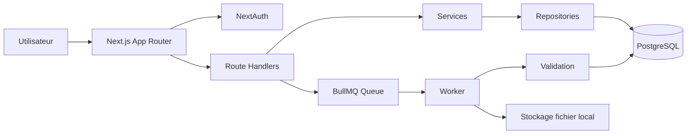

# DataFlow CI

Application Next.js pour automatiser la validation de fichiers CSV/XLSX provenant de sources de donnees clientes. Le projet couvre le challenge Artefact CI : gestion de sources, schemas versionnes, upload asynchrone, rapport d'ingestion, export des lignes valides, dashboard et authentification.

## Fonctionnalites

- Authentification email + mot de passe avec NextAuth Credentials et hash bcrypt.
- Pages `/login`, `/register`, `/logout` et middleware de protection.
- Creation de sources par import de schema JSON Artefact.
- Versionning immutable des schemas importes.
- Modele de colonne pilote par JSON : `string`, `number`, `integer`, `date`, `boolean`, `enum`, required, pattern, valeurs autorisees, min/max, longueurs, format de date.
- Configuration fichier par source : separateur CSV, encoding, header, format.
- Upload CSV/XLSX limite a 10 MB et rattache a une source.
- Traitement asynchrone via BullMQ + Redis et worker separe.
- Validation ligne par ligne avec conservation de toutes les erreurs.
- Rapport d'ingestion : statut, volumes, erreurs detaillees, apercu des lignes valides.
- Export CSV des lignes valides.
- Dashboard Recharts : fichiers par source, qualite des uploads, volume traite par jour.
- Prisma/PostgreSQL, tests Vitest, Docker Compose, configs Vercel/Railway.

## Stack

- Next.js 15 App Router, React, TypeScript strict
- TailwindCSS et composants Shadcn-style locaux
- Prisma + PostgreSQL
- NextAuth
- BullMQ + Redis
- Zod, PapaParse, ExcelJS
- Recharts
- Vitest

## Installation locale

Prerequis :

- Node.js 22+
- Docker Desktop
- npm

```bash
npm install
cp .env.example .env
docker compose up -d
npm run db:migrate
npm run db:seed
```

Sous PowerShell, remplace `cp .env.example .env` par :

```powershell
Copy-Item .env.example .env
```

Lancer l'application :

```bash
npm run dev
```

Dans un deuxieme terminal, lancer le worker BullMQ :

```bash
npm run worker
```

URL locale : [http://localhost:3000](http://localhost:3000)

Compte de test cree par le seed :

- Email : `demo@dataflow.ci`
- Mot de passe : `DemoPassword123!`

## Variables d'environnement

| Variable | Description |
| --- | --- |
| `DATABASE_URL` | URL PostgreSQL utilisee par Prisma |
| `AUTH_SECRET` | Secret NextAuth |
| `AUTH_URL` | URL publique ou locale pour Auth.js |
| `AUTH_TRUST_HOST` | Requis selon l'hebergeur |
| `NEXTAUTH_URL` | URL publique ou locale |
| `REDIS_URL` | URL Redis pour BullMQ |
| `UPLOAD_DIR` | Repertoire de stockage local des fichiers |
| `MAX_UPLOAD_BYTES` | Taille maximale, par defaut 10 MB |

## Commandes utiles

```bash
npm run lint
npm run test
npm run build
npm run db:generate
npm run db:migrate
npm run db:deploy
npm run db:seed
npm run worker
```

## Donnees de test

Le dossier `samples/` contient les fichiers officiels du challenge :

- `source-ventes-orange.json`
- `ventes-orange-clean.csv`
- `ventes-orange-dirty.csv`
- `source-stock-banque.json`
- `stock-banque-clean.csv`
- `stock-banque-dirty.csv`

Le seed cree les deux sources depuis les JSON officiels. Les CSV peuvent etre charges depuis l'interface.

Specificites couvertes :

- Orange CI : separateur `,`, dates `YYYY-MM-DD`.
- Banque Atlantique : separateur `;`, dates `DD/MM/YYYY`.
- Les fichiers `clean` sont testes a 100 % valides.
- Les fichiers `dirty` gardent les lignes valides et produisent des erreurs detaillees.

## Deploiement

### Vercel

1. Creer une base PostgreSQL et un Redis externe.
2. Configurer les variables `.env`.
3. Deployer le projet web avec `vercel.json`.
4. Lancer le worker separe sur Railway, Render ou Fly avec `npm run worker`.

### Railway

1. Creer un service PostgreSQL et un service Redis.
2. Creer un service web avec `npm run start`.
3. Creer un service worker avec `npm run worker`.
4. Appliquer les migrations avec `npm run db:deploy`.

`railway.json` et `Procfile` sont fournis pour documenter les deux processus.

## Architecture rapide



## Workflow de demo

1. Se connecter avec `demo@dataflow.ci` / `DemoPassword123!`.
2. Aller dans `Sources` pour voir les sources creees depuis les JSON.
3. Ou creer une source avec `Nouvelle source`, puis importer un fichier `source-*.json`.
4. Aller dans `Uploads`, envoyer un fichier CSV officiel.
5. Ouvrir le rapport et exporter les lignes valides.

## Tests

Les tests couvrent le coeur de validation, le schema Zod des sources, le parsing CSV avec separateurs differents et les samples officiels clean/dirty.

```bash
npm run test
```

## Limites connues du MVP

- Le stockage fichier est local. En production, S3/GCS serait preferable.
- Le worker est un processus separe a lancer explicitement.
- Pas de roles avances : chaque utilisateur voit seulement ses propres sources.
- Les fichiers tres volumineux devraient etre traites en streaming.

## URL de demonstration

A renseigner apres deploiement public.
